<h1>Parking Ticket App</h1>
<h2><a href="https://github.com/IsaacMellonie/T1A3-Terminal-App">GitHub Source Control</a></h2>
<h2><a href="https://peps.python.org/pep-0008/">Style Guide</a></h2>
<h2><a href="https://github.com/users/IsaacMellonie/projects/1">Project Management</a></h2>
 
<h2>Purpose</h2>

This is a Python project which aims to build a terminal application for purchasing parking tickets. The application provides the user with an interactive application in which they can select different options based on screen prompts, then providing input options through the keyboard. This application receives input from the user and mostly outputs to the terminal, though it's also capable of outputting to a user provided email with built in modules. Data is also collected and stored locally in a credentials file with user email, password, first name, last name, and car registration number. 

If this app was implemented in a real world situation, its most important features would be ease of use, an app that's dependable and runs consistently. A time-saving solution for people who need to buy parking tickets in different parking zones, providing a payment solution where there's no physical option. Ideally, it could be used on any mobile device with an internet connection, working with City Councils and private businesses who need an app to manage the heavy work in creating and maintaining a ticketing system.

<h3>Feature: Ticketing and Receipts</h3>
This feature encompasses the ability to takje the user's input based on screen prompts and interpret those choices into a receipt. The key of this feature would be the ability for it to accept the amount of time the user wants to park for and providing a system for them to pay. This is done by firstly gathering the user's info, then credit card, and then gathering details about how long they'd like to park for. Once this information is gathered the application will calculate the costs based on the time chosen and output a receipt with a total cost including tax, the time the transaction was placed and the expiry time.

<h3>Feature: Signup and Registration</h3>

Registration allows the user to access the sign in and then purchase tickets. It's the first major step the user will need to take in order to use the other features on the app. Firstly, the user will be prompted to enter an email address. multiple checks are completed on teh user's email to make sure it is a usable address. Next, they must enter a password which is atleast 6 - 12 characters long. They'll need to enter it twice to make sure it's correct. Once these first two steps are complete they'll be prompted to enter their first name, last name and finally, car registration number. Once these details are input there'll be a double check prompting the user to confirm. Once confirmed the details are stored locally in the database for recall purposes. Next, the credit card details are needed and must be run through a series of checks to determins that the credite card information is correct. Step 1 in this case is to get the CC number of 16 in length,  and only numbers. Step 2, a 2 digit expiry month. and finally step 3, a 2 digit year. None of this information is stored and ofr the purpose of privacy, this app does not require legitimate CC details to pass these steps. Finally, the user is prompted to enter the amount of minutes between 5 and 120 (2hrs max). Once they've decided how long and it's rounded up or down to be within the corrent range, they'll be charged a base rate per minute, and then tax added. THis receipt is processed and sen tto the user's screen.

<h3>Feature: Data Collection, Storage and Email</h3>

This feature allows for recall of data when it's needed after signup. This is an important feature for user's that may forget their information and need to have the password sent to them. FIrstly, they'll enter the password via the terminal, and if it matches the one kept on the local file the email will go through the emailing system created to connect to an ssl port, then using an smtp gmail server, will send the password. 

<h2>Implementation Plan</h2>
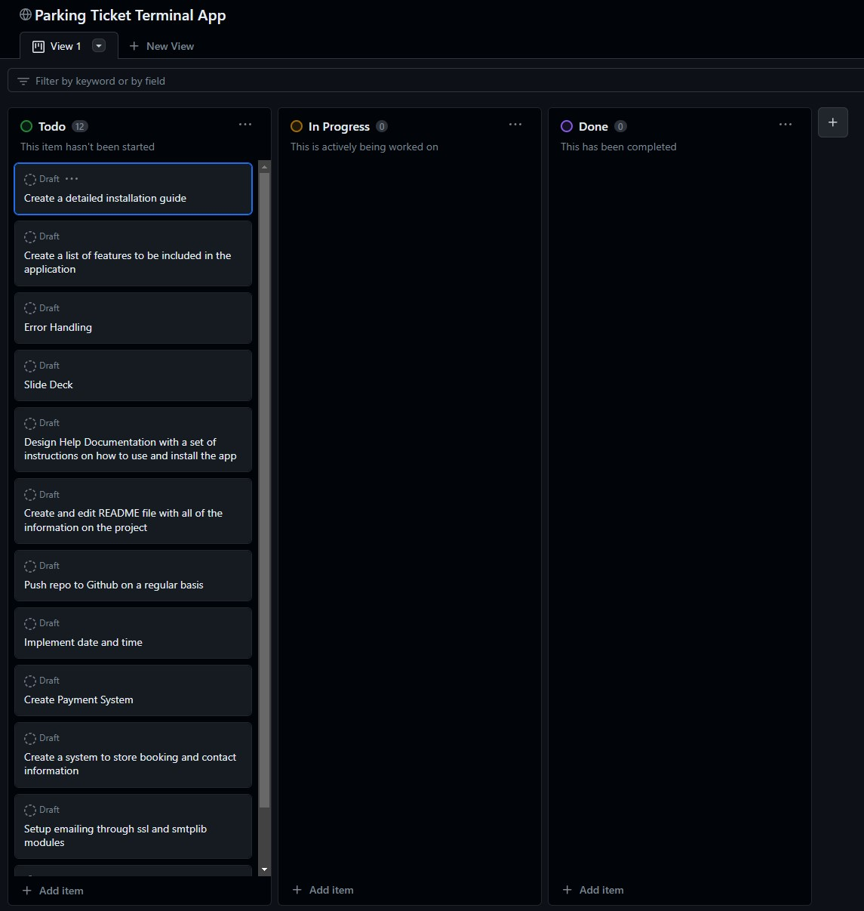
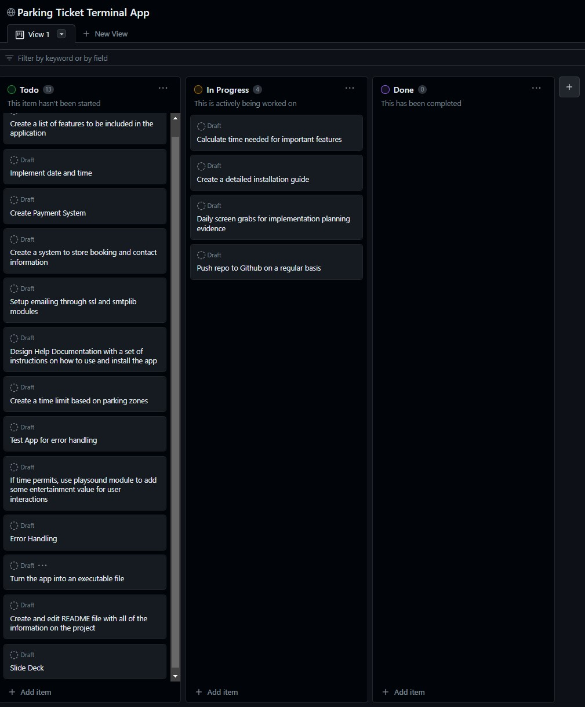
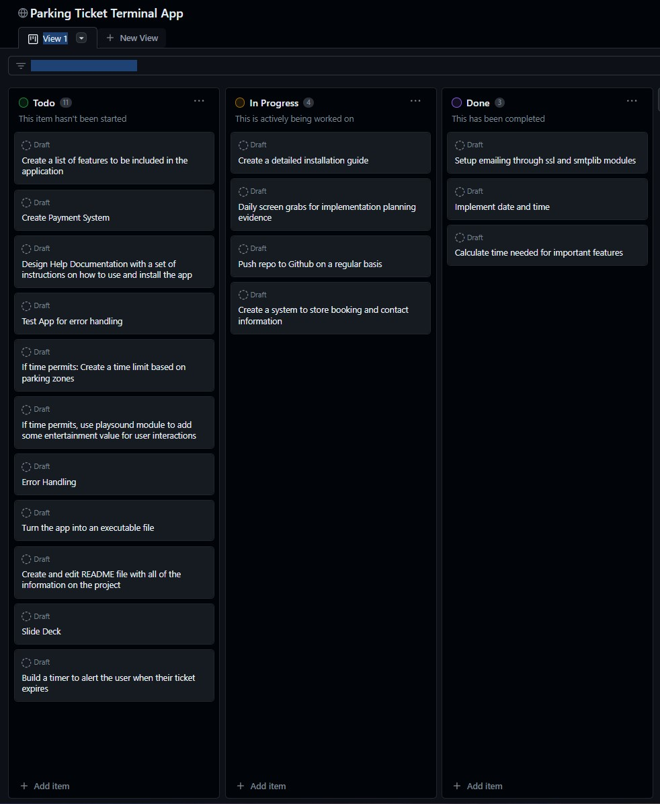
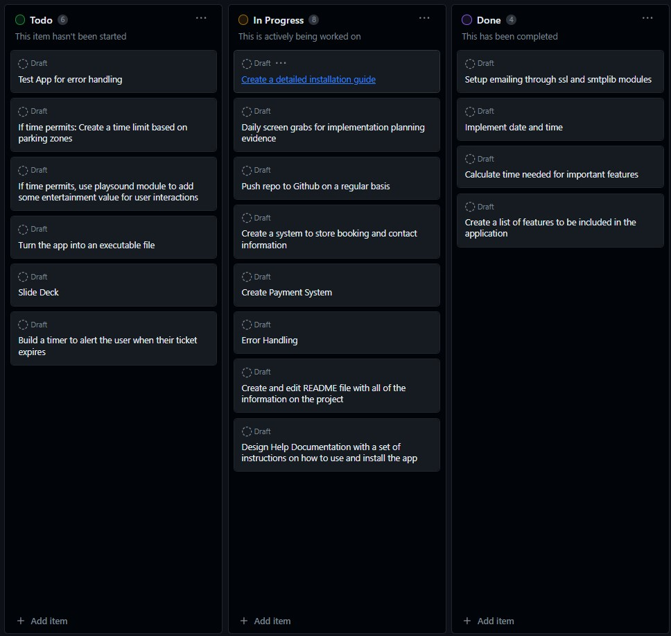
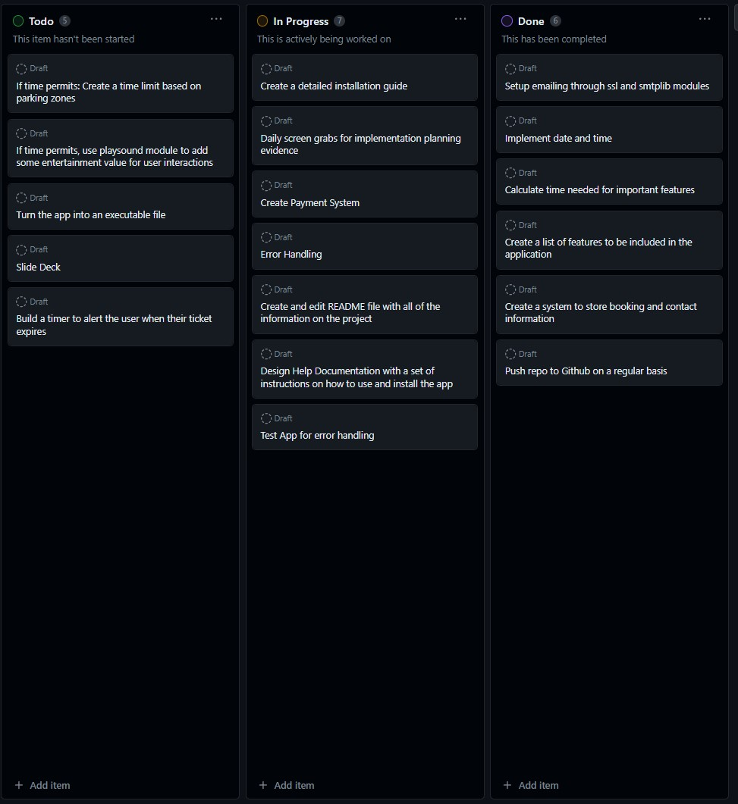
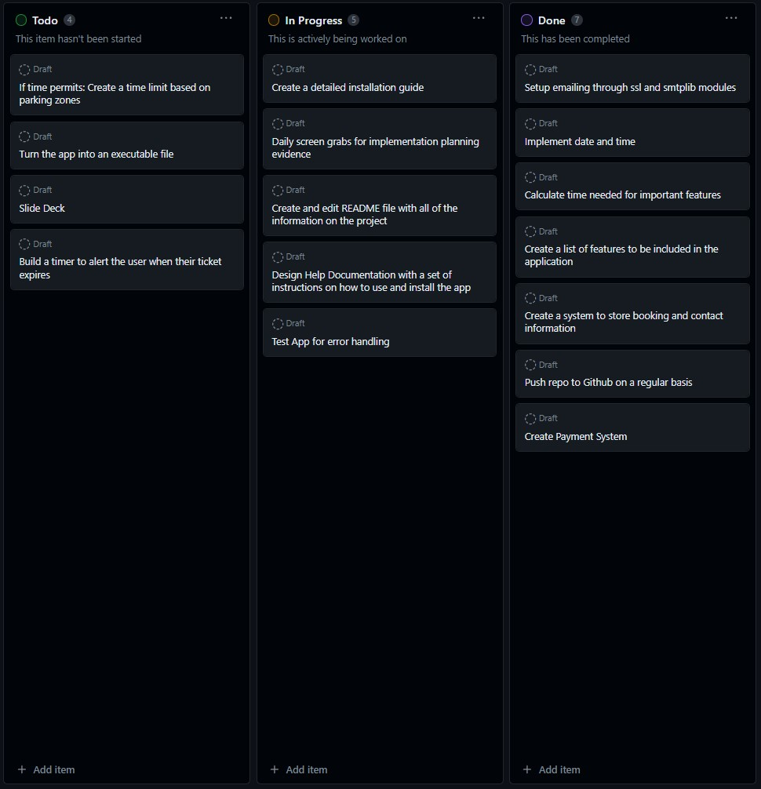
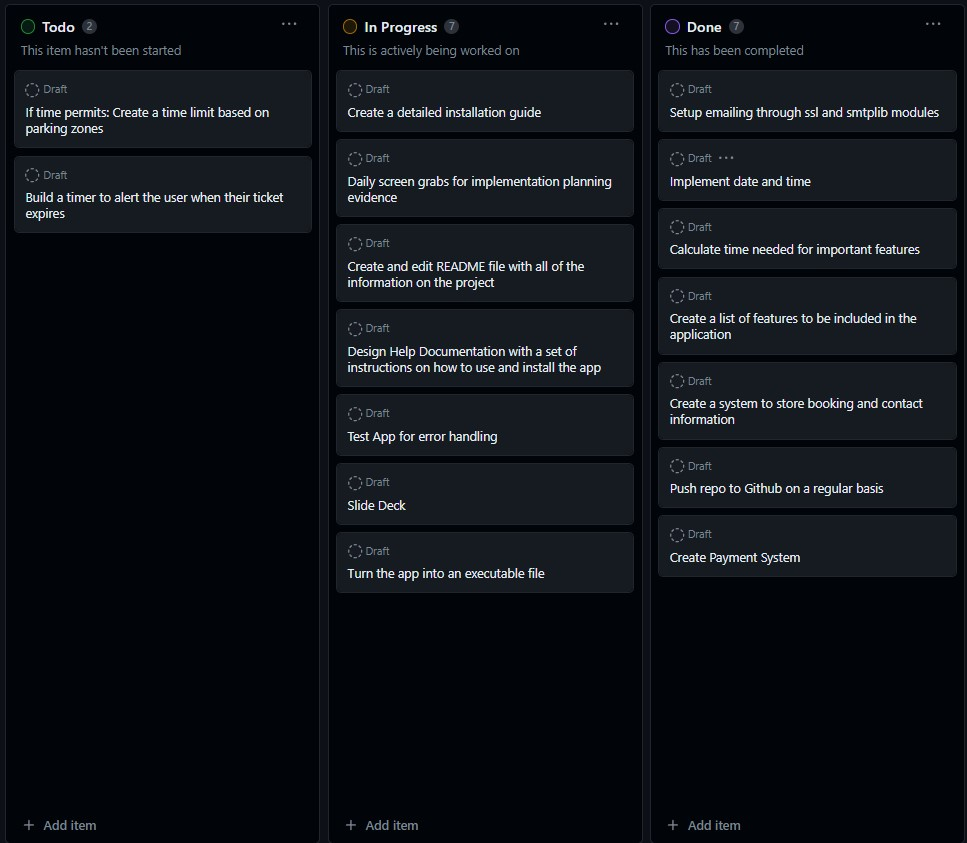
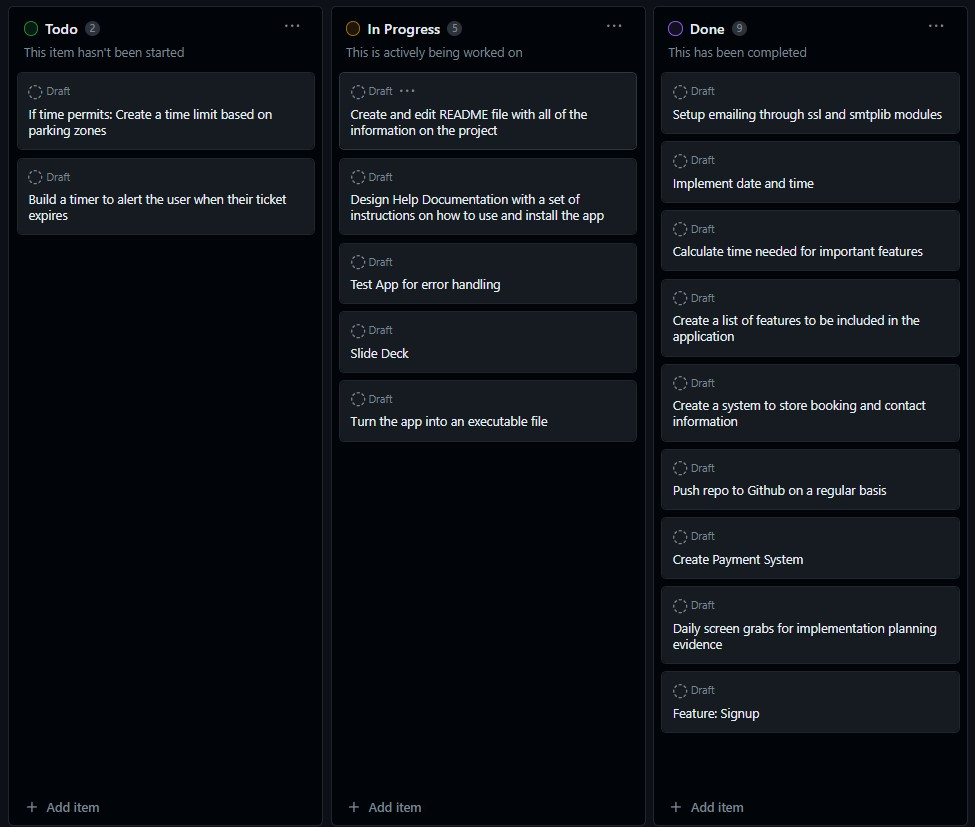
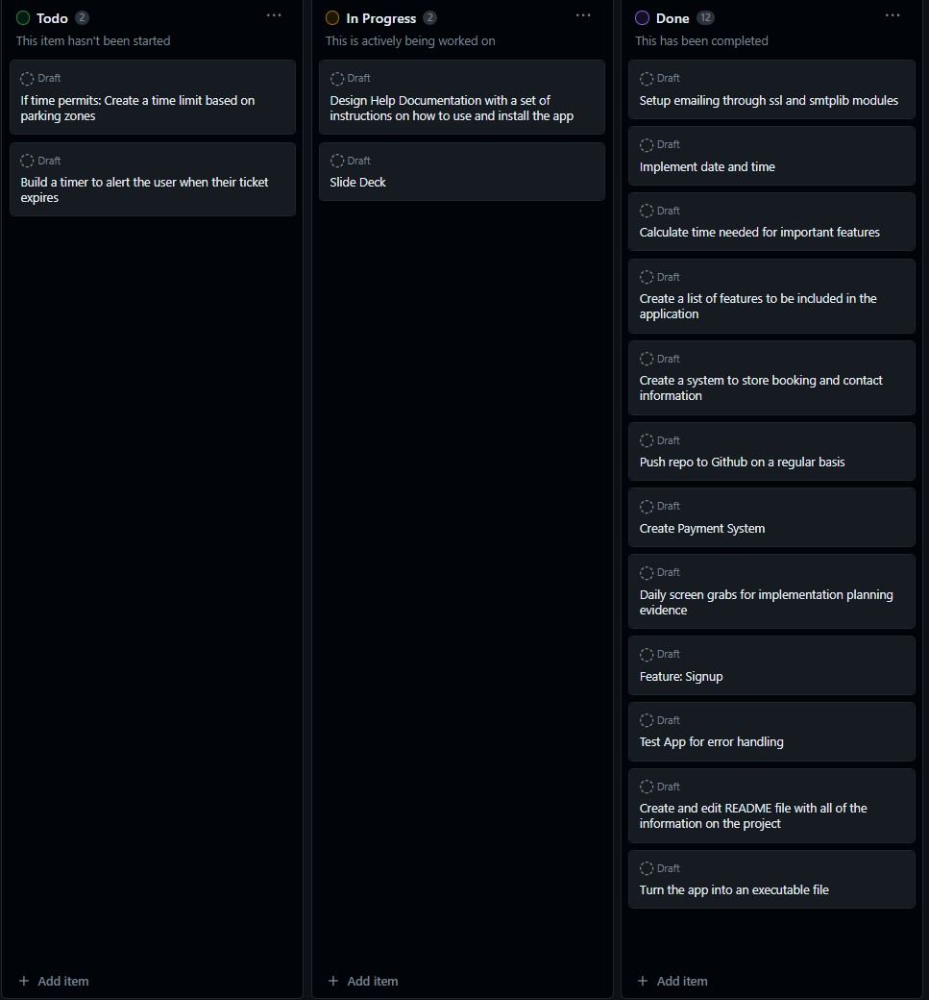
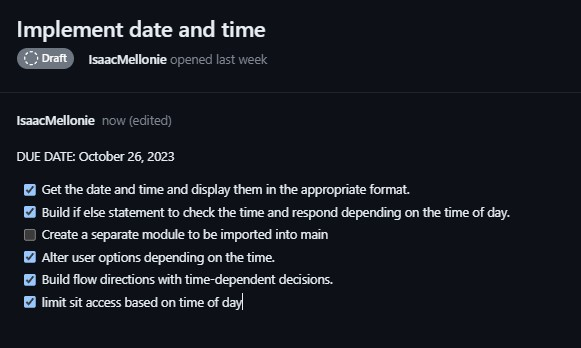
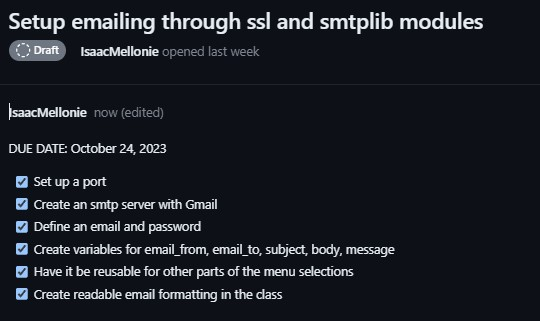
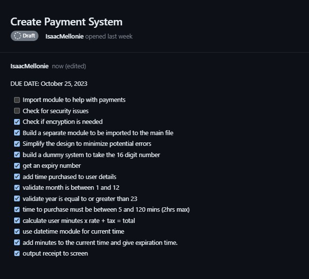
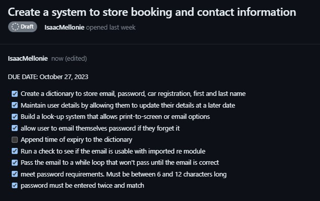

<h2>Getting Started</h2>

First of all, we want to create a new email acount using Gmail. This will be specificailly used for emailing from the application in Python. Then follow the steps below to complete the setup process.

<ol>
<li> 
You can use your existing gmail account or make a new gmail account depending on what you prefer. Once you've decided, you'll have to turn on 2 factor authentication and create an App Password.
 
 
<ol type = "a">
<li></li>
<li></li>
<li></li>
<li></li>
<li></li>
</ol>
</li>
<li>
In the email_setup.py file, paste your email address and password. This will be used in the main file and without it the emailing function won't work.
</li>
<li>

</li>
</ol>

<h2>R5 Styleguide</h2>

This project adheres to PEP 8 styling conventions. This is the styling convention I've been using since first learning to code in Python so I'll continue to use it.

