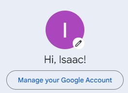
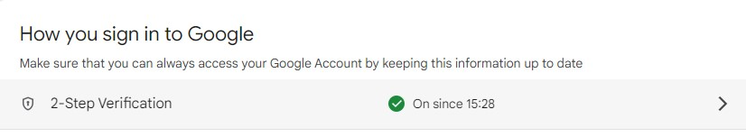
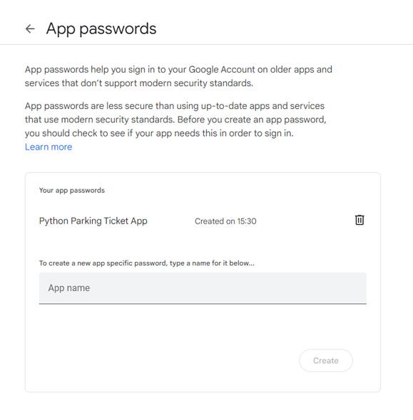

<h1>Isaac Eveans Mellonie T1A3</h1>
<h2>Parking Ticket App</h2>

This is a Python project which aims to build a terminal application for purchasing parking tickets. User experience is the guide for what features are most important. Receipts can be sent to the user's email using terminal input. This is achieved by making use of built-in Python modules such as ssl and smtplib. It aims to be an application that's light, DRY and runs consistently without any errors. 

If this app was implemented in a real world situation, its most important features would be ease of use, an app that's dependable and runs consistently when it's needed. A time-saving solution for people who need to buy parking tickets in different parking zones, providing a payment solution where there's no physical option. Ideally, it could be used on any mobile device, working with City Councils and private businesses who need an app to manage the heavy work in creating and maintaining a ticketing system.

<h2>Getting Started</h2>

First of all, we want to create a new email acount using Gmail. This will be specificailly used for emailing from the application in Python. Then follow the steps below to complete the setup process.

<ol>
<li> 
You can use your existing gmail account or make a new gmail account depending on what you prefer. Once you've decided, you'll have to turn on 2 factor authentication and create an App Password.
 
 
<ol type = "a">
<li></li>
<li></li>
<li></li>
<li></li>
<li></li>
</ol>
</li>
<li>
In the email_setup.py file, paste your email address and password. This will be used in the main file and without it the emailing function won't work.
</li>
<li>

</li>
</ol>

<h2>R5 Styleguide</h2>

This project adheres to PEP 8 styling conventions. This is the styling convention I've been using since first learning to code in Python so I'll continue to use it.

